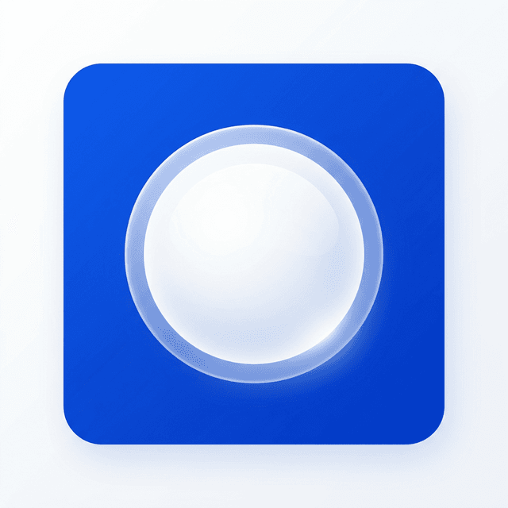

<div align="center">
  
  <h1>Snowball</h1>
  <p><b>A local-first productivity hub for staying consistent — without the app-switching fatigue.</b></p>
  <p>
    <a href="https://github.com/Horrid-12/Snowball/releases"></a>
    <a href="./LICENSE"></a>
    <a href="https://github.com/Horrid-12/Snowball/actions/workflows/codeql.yml"></a>
    
    
    
  </p>
  <p>
    <a href="#features">Features</a> ·
    <a href="#architecture">Architecture</a> ·
    <a href="#preview">Preview</a> ·
    <a href="#get-started">Get started</a> ·
    <a href="#installation">Installation</a> ·
    <a href="#status">Status</a> ·
    <a href="#license">License</a>
  </p>
</div>

Snowball replaces the daily juggle of a task manager, habit tracker, focus timer, and notes app with a single system — one source of truth for your routine on **Windows, macOS, Linux, Android, and the web**. Everything is stored locally first and synced to the cloud in the background, so the app stays fast and keeps working offline.

---

##  Features

###  Task Management

- **Planning & execution**: priorities, dates, and time blocks for your day.
- **Progress tracking**: completion counts and effort allocation per task.
- **Tagging**: custom, color-coded tags for effortless categorization.

###  Habit Tracking

- **Consistency first**: a dedicated tracker for daily habits.
- **Visual momentum**: an activity heatmap that shows your streaks over months.

###  Deep Work & Focus

- **Focus timer**: a built-in timer to cut out distractions and enter a flow state.
- **Session tracking**: logged focus hours feed into your productivity score.

###  Knowledge & Scratchpad

- **Quick notes**: a low-friction scratchpad for reminders, ideas, and temporary logs.
- **Zero overhead**: fast access to information without maintaining a full wiki.

###  Media Hub

- **Spotify & YouTube**: bring study/work soundtracks and tutorials straight into your focus environment.

##  Architecture

Snowball is built on a **local-first** philosophy: immediate responsiveness and offline availability come before constant network connectivity. For a deeper dive, see [ARCHITECTURE.md](./ARCHITECTURE.md).

###  Sync Engine

- **Immediate UI (optimistic updates)**: every mutation is applied to local state and IndexedDB (via Dexie.js) instantly.
- **Eventually consistent**: changes are pushed to the cloud (Supabase) in the background.
- **The outbox pattern**: if a network request fails, the mutation is stored in a local `outbox` queue and replayed automatically when connectivity is restored.

### Tech Stack

| Layer            | Stack                                                                                                                                                                                                                                                                                                                                                                                                              |
| ---------------- | ------------------------------------------------------------------------------------------------------------------------------------------------------------------------------------------------------------------------------------------------------------------------------------------------------------------------------------------------------------------------------------------------------------------ |
| Frontend         |      |
| Local storage    |                                                                                                                                                                                                                                                                                                                                         |
| Backend          |                                                                                                                                                            |
| Database & auth  |                                                                                                                                                                                                                                |
| Desktop & mobile |                                                                                                                                                                                                                  |
| Hosting          |                                                                                                                                                                                                                                                                                                                                   |

##  Preview

<!-- Add screenshots to docs/assets/preview/ and uncomment:


-->

Screenshots are on the way — check back after the next release.

##  Get Started

Run the app from source. Prerequisites: [Node.js](https://nodejs.org/) 22+ and git.

```bash
git clone https://github.com/Horrid-12/Snowball.git
cd Snowball
npm run install:all
cp backend/.env.example backend/.env
npm run dev
```

<details>
<summary>Windows PowerShell users</summary>

```powershell
git clone https://github.com/Horrid-12/Snowball.git
cd Snowball
npm run install:all
Copy-Item backend\.env.example backend\.env
npm run dev
```

</details>

Before the backend can start, fill in `backend/.env`:

| Variable                      | Required | Purpose                                                       |
| ----------------------------- | -------- | ------------------------------------------------------------- |
| `JWT_SECRET`                | yes      | Signs auth tokens — any random string is fine in development |
| `SUPABASE_URL`              | yes      | Your Supabase project URL                                     |
| `SUPABASE_SERVICE_ROLE_KEY` | yes      | Server-side service role key — never expose it to clients    |
| `SUPABASE_ANON_KEY`         | yes      | Anon key used for RLS-scoped, user-token queries              |
| `VITE_DISCORD_CLIENT_ID`    | no       | Discord sign-in (frontend)                                    |

The app then runs at:

- Frontend: [http://localhost:5173](http://localhost:5173)
- Backend: [http://localhost:3000](http://localhost:3000)

##  Installation

Download a prebuilt app from [Releases](https://github.com/Horrid-12/Snowball/releases):

| Platform                        | Download Artifact             | Installation / Running                                                                                |
| ------------------------------- | ----------------------------- | ----------------------------------------------------------------------------------------------------- |
| **Windows**               | `Snowball_*_x64-setup.exe`  | Run the installer and launch Snowball from the Start Menu.                                            |
| **macOS (Apple Silicon)** | `Snowball_*_aarch64.dmg`    | Open the`.dmg`, drag `Snowball.app` into **Applications**. *(See Gatekeeper note below.)* |
| **macOS (Intel)**         | `Snowball_*_x64.dmg`        | Open the`.dmg`, drag `Snowball.app` into **Applications**. *(See Gatekeeper note below.)* |
| **Linux (Ubuntu/Debian)** | `snowball_*_amd64.deb`      | Run`sudo apt install ./snowball_*_amd64.deb` (or double-click to install).                          |
| **Linux (Universal)**     | `Snowball_*_amd64.AppImage` | Run`chmod +x Snowball_*.AppImage`, then `./Snowball_*.AppImage`.                                  |
| **Android**               | `Snowball_*_Android.apk`    | Sideload and install the APK on your device.                                                          |

> [!NOTE]
> **macOS first launch (Gatekeeper):** Because Snowball is community open-source and not signed with an Apple Developer ID certificate ($99/yr), macOS will flag the app on first launch. To run it:
>
> 1. Right-click (or Control-click) `Snowball.app` in `/Applications` and select **Open**.
> 2. Click **Open** in the confirmation dialog.
> 3. *Alternative:* Go to **System Settings → Privacy & Security**, scroll down to Security, and click **Open Anyway** (or run `xattr -cr /Applications/Snowball.app` in Terminal).

##  Status

**Current stage: active development.** Features are added and refined frequently. Contributions and feedback are welcome — see [Issues](https://github.com/Horrid-12/Snowball/issues) for current bugs and feature requests.

##  Contributing

Contributions, bug reports, and feature requests are all welcome:

1. Fork the repository and create a feature branch.
2. Make your changes — see [Get Started](#get-started) to run the app locally.
3. Open a pull request describing what changed and why.

Report bugs and propose features in [Issues](https://github.com/Horrid-12/Snowball/issues). For security matters, follow [SECURITY.md](./SECURITY.md).

##  License

Distributed under the MIT License. See [`LICENSE`](./LICENSE) for details.
